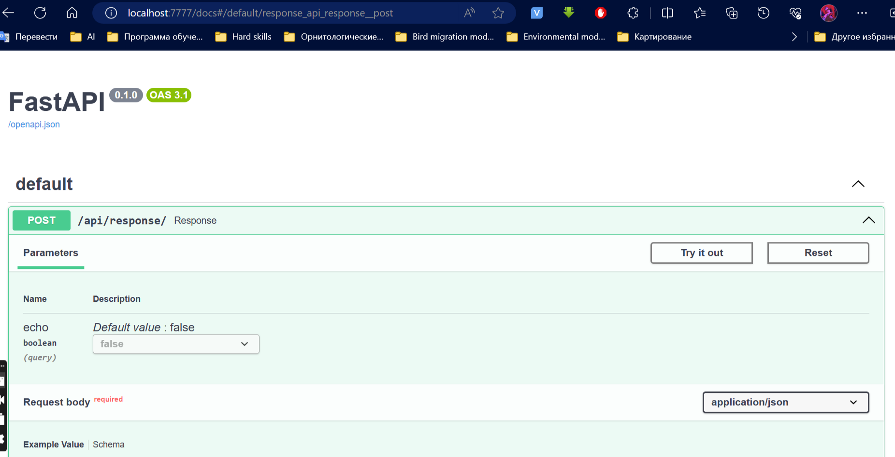

Инструкция по отправке запросов к API, развернутому с использованием FastAPI и доступному через Swagger UI на localhost:7777.

**Шаг 1: Доступ к Swagger UI**

В Линукс системе запустите скрипт, который установит зависимости и запустит приложение.
```bash
git clone <this_repo>
cd <this_repo>
bash start.sh
```

Откройте браузер и перейдите по адресу http://localhost:7777/docs. Если ваше приложение запущено на другом порту, замените 7777 на соответствующий порт.


**Шаг 2: Отправка запросов**

После открытия `Swagger UI`, вы увидите один эндпоинт - Response.
При нажатии откроется поле, где можно будет задать параметры запроса. 


Перейдите на вкладку *"Try it out"* для выбранного метода.
Заполните параметры запроса в соответствии с требованиями вашего API. Например, введите ваш запрос в поле "Request body".
Нажмите на кнопку "Execute", чтобы отправить запрос.
Результат выполнения запроса будет отображен ниже, включая статус запроса и ответ от сервера.

**Шаг 3: Пример запроса**
Вот пример запроса в формате JSON, который можно отправить через Swagger UI:

```json
{
    "context": [
        {
            "role": "user",
            "content": "How do temperature preferences differ between forest seedeaters and other species?"
        }
    ]
}
```
[Ответ](response.json) будет содержать: ответ модели и 3 наиболее релевантных источника.


