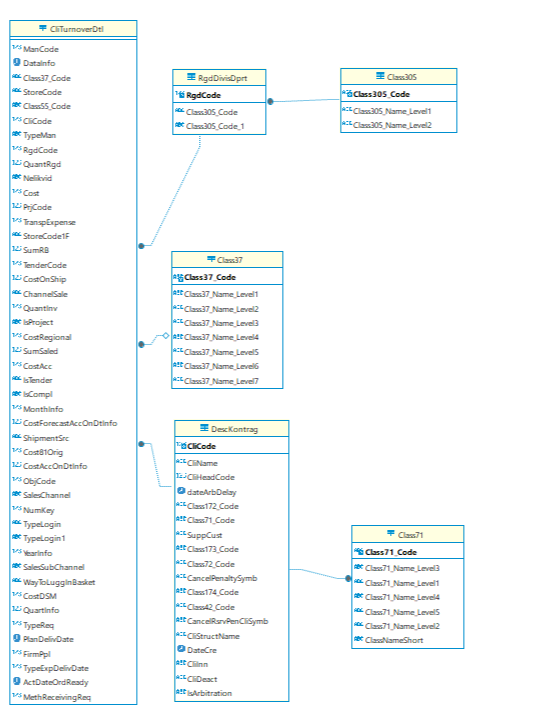

Чтобы запустить вертику в докере:

```bash
docker pull dataplatform/docker-vertica
docker run -p 5433:5433  dataplatform/docker-vertica
```

Параметры подключения:
* Имя БД по умолчанию - docker

* Пользователь по умолчанию - dbadmin

* Пароль по умолчанию (БЕЗ ПАРОЛЯ) -

### Ход работы


1. Запускаются скрипты на создание базы данных, которые находятся в [create_db.sql](scripts/create_bd.sql).
2. Добавляем Внешние ключи, чтобы связать таблицы при помощи скрипта [fk.sql](scripts/fk.sql).

3. Вставляем примеры данных, используя [insert.sql](scripts/insert_bd.sql). И получаем такую бд:
    
    
    

4. Запускаем скрипты на расчет витрины в [vitrina.sql](scripts/vitrina.sql).

Для более оптимального выполнения соединения разных таблиц создаются временные таблицы с предварительно отфильтрвоанными или выбранными данными, что уменьшит трудозатраты при объединении данных. Кроме того, сделаем это, используя `ON COMMIT PRESERVE ROWS`, чтобы использовать временные таблицы в рамках одной транзакции (одного скрипта).

Например, для фильтрации данных сразу за 24 последних месяца:

```sql
CREATE LOCAL TEMP TABLE FilteredCliTurnoverDtl ON COMMIT PRESERVE ROWS AS
SELECT
    md5(DataInfo::VARCHAR || CliCode::VARCHAR || RgdCode::VARCHAR || Class37_Code || SalesChannel) AS row_id,
    DataInfo,
    CliCode,
    RgdCode,
    Class37_Code,
    SalesChannel,
    SumSaled
FROM public.CliTurnoverDtl
WHERE
    DataInfo >= CURRENT_DATE - INTERVAL '24 months';
```

В итоге получена витрина анализа данных по:
-	Периодам (месяц, квартал, полугодие, год)
-	По Дивизионам (первый уровень 305 классификатора – 3 символа кода)
-	По товарным отделам (второй уровень 305 классификатора – 6 символов кода)
-	По каналам продаж
-	По целевым клиентским группам покупателей (относительно первых двух символов Class71_Code)
-	По первому уровню территориальной структуры менеджеров компании (первый символ Class37_Code) – уровень региона
-	По второму уровню территориальной структуры менеджеров компании (первые 2 символа Class37_Code) –  уровень города

```sql
CREATE TABLE Vitrina AS
SELECT
    ad.YEAR,
    ad.MONTH,
    ad.QUARTER,
    ad.HALFYEAR,
    SUBSTRING(dk.Class71_Code FROM 1 FOR 2) AS ClientGroupCode,
    SUBSTRING(rd.Class305_Code FROM 1 FOR 3) AS ProductDivisionCode,
    SUBSTRING(rd.Class305_Code FROM 1 FOR 6) AS ProductDepartmentCode,
    SUBSTRING(c37.Class37_Code FROM 1 FOR 1) AS ManagerRegionCode,
    SUBSTRING(c37.Class37_Code FROM 1 FOR 2) AS ManagerCityCode,
    ad.SalesChannel,
    ad.TotalSales
FROM
    AggregatedData ad
    JOIN FilteredDescKontrag dk ON ad.CliCode = dk.CliCode
    JOIN FilteredClass71 c71 ON dk.Class71_Code = c71.Class71_Code
    JOIN FilteredRgdDivisDprt rd ON ad.RgdCode = rd.RgdCode
    JOIN FilteredClass37 c37 ON ad.Class37_Code = c37.Class37_Code;

```